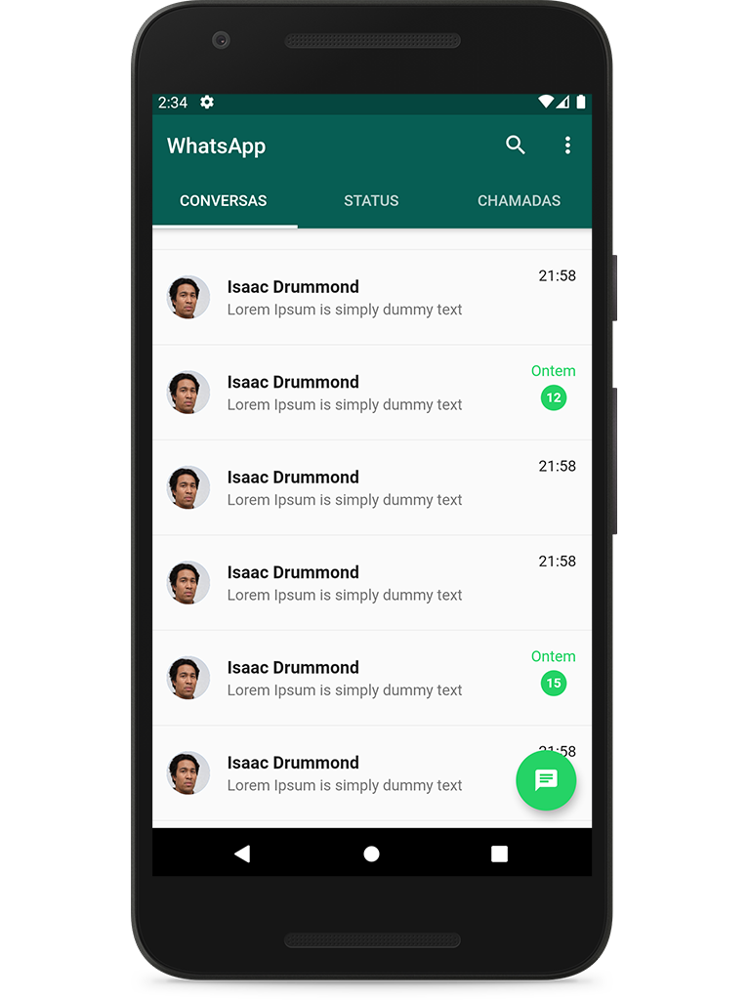
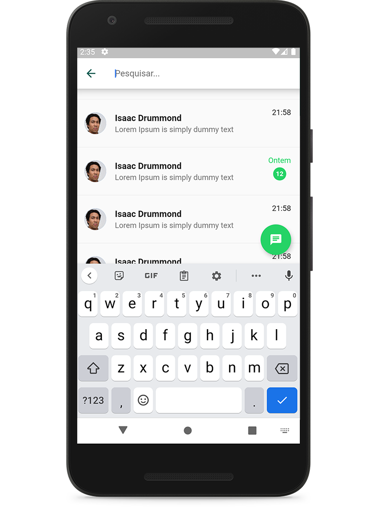

## :iphone: WhatsApp Clone 
Building a WhatsApp Clone with Flutter.

<h1 align="center">
    
    
</h1>
 
## :recycle: How to contribute  
- Fork this repository
- Create a branch with your feature: `git checkout -b my-feature`
- Commit your changes: `git commit -m 'feat: My new feature'`
- Push your branch: `git push origin my-feature`

## :memo: License  
This project is under the MIT license. See the [LICENSE](LICENSE)  for more information.
